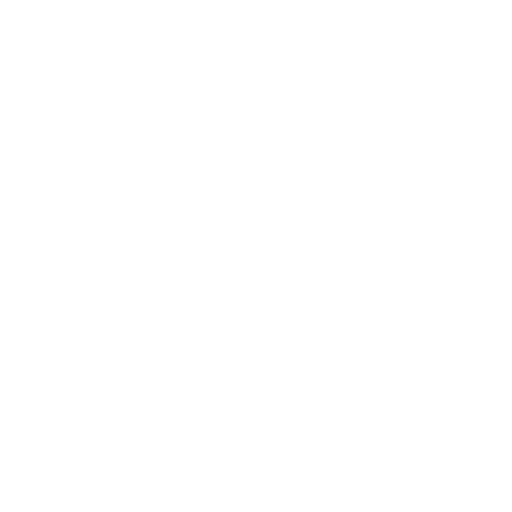

<div align="center">

<!-- Animated banner using SVG / shields -->


# ✦ Mazen Abdallah — Portfolio

**A fully static, CMS-powered personal portfolio with zero backend.**

[](https://mazen657.github.io/Portfolio/)
[](https://mazen657.github.io/Portfolio/)
[](https://developer.mozilla.org/en-US/docs/Web/HTML)
[](https://developer.mozilla.org/en-US/docs/Web/CSS)
[](https://developer.mozilla.org/en-US/docs/Web/JavaScript)

</div>

---

## 🔗 Live Preview

> **[https://mazen657.github.io/Portfolio/](https://mazen657.github.io/Portfolio/)**

Open the link above in any browser to view the live deployed version — no installation needed.

---

## 📋 Table of Contents

- [Overview](#-overview)
- [Features](#-features)
- [Project Structure](#-project-structure)
- [How the CMS Works](#-how-the-cms-works)
- [Sections](#-sections)
- [Technologies Used](#-technologies-used)
- [Getting Started](#-getting-started)
- [Customization Guide](#-customization-guide)
- [Responsive Design](#-responsive-design)
- [Browser Support](#-browser-support)
- [License](#-license)

---

## 🧠 Overview

This is a **fully static personal portfolio** that runs entirely in the browser with no server or database required. Content (certificates, projects, and skills) is managed through a **Google Sheet** and rendered dynamically at runtime via the [OpenSheet API](https://opensheet.elk.sh) — making it easy to add new work without ever touching the codebase.

The design uses a **dark, space-inspired aesthetic** with fluid animations, glassmorphism cards, a typewriter headline, a parallax profile image, and a sticky animated SVG cube in the Education section.

---

## ✨ Features

| Feature | Description |
|---|---|
| 🗄️ **No-Backend CMS** | Content pulled live from Google Sheets — update your portfolio by editing a spreadsheet |
| 🎞️ **Typed.js Headline** | Animated rotating job titles in the hero section |
| 🧊 **Animated SVG Cube** | Custom SVG cube with star-field texture in the Education / Timeline section |
| 📜 **Timeline** | Left/right alternating certificate cards with smooth reveal animations |
| 🔍 **Project Filter** | Category filter bar with animated show/hide and staggered card entrances |
| 🖼️ **Smart Media** | Auto-detects YouTube embeds, Cloudinary videos, or images per project card |
| 🖱️ **Cursor Glow** | Soft radial gradient that lazily trails the mouse (desktop only) |
| 🌊 **Parallax Image** | Profile photo animates out when scrolling to About, and back when returning to Home |
| 📱 **Fully Responsive** | 10 breakpoints from 320 px tiny phones to 1600 px ultra-wide monitors |
| ♿ **Accessible** | Keyboard navigation for filter bar, ARIA labels, focus-visible outlines, reduced-motion support |
| 📨 **Contact Form** | Powered by [Formspree](https://formspree.io) — no server needed |

---

## 📁 Project Structure

```
Portfolio/
│
├── index.html          # Main HTML — all sections in one page
├── styles.css          # Full design system (variables, layout, components)
├── responsive.css      # All breakpoints (320 px → 1600 px+)
├── main.js             # UI interactions (nav, scroll, parallax, cursor, filter)
├── Admin.js            # CMS engine — fetches & renders Google Sheet content
│
└── assets/
    ├── silhouette.png  # Logo / favicon
    └── *.png           # Profile photo and other images
```

---

## 🗃️ How the CMS Works

Content is stored in a **Google Sheet** and served as JSON by the free [OpenSheet](https://opensheet.elk.sh) proxy. No authentication or API key is required.

### Setup (already configured)

The Google Sheet ID and sheet name are defined at the top of `Admin.js`:

```js
const SPREADSHEET_ID = "1ASSXeZykE583Me-jSFIjATUfGSsufDyVqY5hF530bn8";
const SHEET_NAME     = "Certificates%20Manager";
```

### Adding Content

Open the Google Sheet and add a new row. Set the **"What do you want to add?"** column to one of:

| Value | Renders as |
|---|---|
| `Add Certificate` | A timeline card in the Education section |
| `Add Project` | A project card with image/video + GitHub link |
| `Add Skill` | A skill icon card in the Skills section |

Rows with an empty type column are treated as certificates (legacy behaviour).

### Column Reference

| Column | Used by |
|---|---|
| `Title` | Certificate title |
| `Issuer` | Certificate issuer name |
| `Date` | Issue date (any parseable format) |
| `Certificate Image URL` | Certificate preview image |
| `Certificate URL` | Link to verify or open the certificate |
| `Project Title` | Project card title |
| `Project Category` | Used for filter buttons (comma or `/` separated) |
| `Project Image URL` | Supports Cloudinary, YouTube, video files, or Drive |
| `Project Live URL` | Link wrapping the project image |
| `GitHub Repository URL` | GitHub button below the project title |
| `Skill` | Skill name |
| `Skill Image URL` | Skill icon (Cloudinary or Drive) |

> **Image URLs** — the CMS auto-converts Google Drive share links to direct embed URLs, and detects YouTube / Cloudinary video vs image automatically.

---

## 📄 Sections

| Section | Description |
|---|---|
| **Home** | Hero with animated typed headline, CTA button, social links, and profile image |
| **About** | Short bio with a parallax animation when scrolling to this section |
| **Education** | Sticky SVG cube + scrollable left/right timeline of certificates |
| **Skills** | Responsive grid of skill cards loaded from the Google Sheet |
| **Projects** | Filterable card grid with image/video/YouTube media support |
| **Contact** | Formspree-powered contact form + contact info panel |

---

## 🛠️ Technologies Used

| Technology | Purpose |
|---|---|
| **HTML5** | Semantic page structure |
| **CSS3** | Custom properties, Grid, Flexbox, animations, `position: sticky` |
| **Vanilla JavaScript** | All interactivity — no frameworks |
| **[Typed.js](https://mattboldt.com/demos/typed-js/)** | Typewriter animation in the hero |
| **[OpenSheet](https://opensheet.elk.sh)** | Google Sheets → JSON proxy |
| **[Formspree](https://formspree.io)** | Contact form email backend |
| **[Font Awesome 7](https://fontawesome.com)** | Icons throughout the site |
| **[Google Fonts](https://fonts.google.com)** | Syne (display), DM Sans (body), Dancing Script (accent) |
| **GitHub Pages** | Free static site hosting |

---

## 🚀 Getting Started

### View online (recommended)

Just open the live site:
**[https://mazen657.github.io/Portfolio/](https://mazen657.github.io/Portfolio/)**

### Run locally

No build tools or package manager required — it's plain HTML/CSS/JS.

```bash
# 1. Clone the repository
git clone https://github.com/Mazen657/Portfolio.git

# 2. Navigate into the folder
cd Portfolio

# 3. Open in browser
#    Option A — double-click index.html
#    Option B — use a local server (recommended to avoid CORS on the fetch)
npx serve .
# or
python -m http.server 8080
```

Then visit `http://localhost:8080` (or whichever port is shown).

> ⚠️ Opening `index.html` directly as a `file://` URL may block the Google Sheets fetch due to CORS. Use a local server for the CMS to work correctly.

---

## 🎨 Customization Guide

### 1. Change personal info

Edit `index.html` directly:
- **Name** → search for `Mazen Abdallah` and replace
- **Social links** → update the `href` values on the `<a>` tags in the Home and Contact sections
- **Phone / Email / Address** → update the `<ul class="info-details">` in the Contact section
- **Profile image** → replace `./assets/2jvFXY3RSpLFfktW6G5C5yfPBi6.png` with your own image

### 2. Change the Google Sheet

In `Admin.js`, update:

```js
const SPREADSHEET_ID = "YOUR_SHEET_ID_HERE";
const SHEET_NAME     = "YOUR_SHEET_NAME_HERE";
```

Make sure the sheet is published publicly: **File → Share → Publish to web**.

### 3. Change the contact form endpoint

In `index.html`, find:

```html
<form action="https://formspree.io/f/mbdabqon" method="POST">
```

Replace `mbdabqon` with your own [Formspree](https://formspree.io) form ID.

### 4. Change colours

All colours are CSS custom properties in `styles.css`:

```css
:root {
  --primary   : #2C74B3;   /* main blue */
  --accent    : #03bcf4;   /* cyan highlight */
  --secondary : #0A2647;   /* dark navy */
}
```

### 5. Change typed headline strings

In `main.js`:

```js
var typed = new Typed(".span7", {
  strings: [
    "Web Designer",
    "Web Developer",
    "ML Enthusiast",
    /* add your own here */
  ],
  ...
});
```

---

## 📱 Responsive Design

The layout adapts across **10 breakpoints** defined in `responsive.css`:

| Breakpoint | Target |
|---|---|
| ≥ 1600 px | Ultra-wide / large desktop |
| ≥ 1400 px | Large desktop |
| ≤ 1280 px | Standard desktop |
| ≤ 1100 px | Small desktop / large laptop |
| ≤ 960 px | Landscape tablet / small laptop |
| ≤ 768 px | Portrait tablet (mobile nav activates) |
| ≤ 600 px | Large phone / phablet |
| ≤ 480 px | Standard phone |
| ≤ 380 px | Small phone |
| ≤ 320 px | Tiny phone |

Additional queries handle: landscape phone orientation, high-DPI/Retina screens, touch/no-hover devices, and `prefers-reduced-motion`.

---

## 🌐 Browser Support

| Browser | Support |
|---|---|
| Chrome / Edge (Chromium) | ✅ Full |
| Firefox | ✅ Full |
| Safari (macOS / iOS) | ✅ Full |
| Samsung Internet | ✅ Full |
| Opera | ✅ Full |

> `position: sticky` and `overflow: clip` are used — both supported in all modern browsers (Chrome 88+, Firefox 81+, Safari 14+).

---

## 📬 Contact

**Mazen Abdallah**

- 🌐 Portfolio: [mazen657.github.io/Portfolio](https://mazen657.github.io/Portfolio/)
- 💼 LinkedIn: [linkedin.com/in/mazen-abdallah-mohamed](https://www.linkedin.com/in/mazen-abdallah-mohamed/)
- 🐙 GitHub: [github.com/Mazen657](https://github.com/Mazen657)
- 📧 Email: [mazenabdallah945@gmail.com](mailto:mazenabdallah945@gmail.com)

---

## 📝 License

This project is open source. Feel free to use it as inspiration or a starting template — a credit or star ⭐ is always appreciated!

---

<div align="center">

Made with ❤️ by **Mazen Abdallah** · Deployed on **GitHub Pages**

[](https://github.com/Mazen657/Portfolio)

</div>